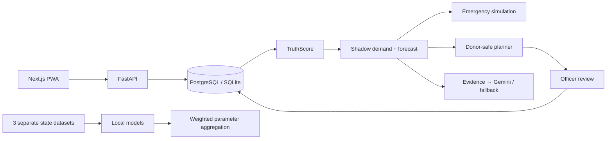

# ArogyaMesh

**A federated resilience autopilot for India's Primary Health Centre network.**

Verify → Predict → Simulate → Redistribute → Learn.

Predict which facility may run short, explain how trustworthy its stock records are, and find a transfer that keeps donor facilities safe. ArogyaMesh is an intelligence layer that could integrate with e-Aushadhi/HMIS/ABDM-like systems; this prototype only uses synthetic aggregated data.

> ArogyaMesh is a hackathon decision-support prototype. It must not be used for real clinical or government logistics decisions without independent validation, security review, operational governance, and integration with authoritative data systems.

## Standalone project

This is the separate hackathon project at `projects/arogyamesh`. It has no dependency on the sibling Vighnaharta game. Recovery preserved the existing API, synthetic data generator and analytics code; see [recovery matrix](docs/RECOVERY.md).

## What works

- 81 PHCs across Andhra Pradesh, Karnataka and Telangana; 9 districts; 20 medicines; 90 days of synthetic history.
- PHC digital twins with batch-aware stock, footfall, beds, aggregate personnel attendance and service capacity.
- **TruthScore:** freshness, reconciliation, consistency, synchronization and anomaly breakdown. Data confidence and forecast confidence are distinct.
- **Shadow demand:** estimates demand during censored zero-stock periods from prior in-stock dispensing and footfall.
- Statistical 1/3/5/7/14-day medicine forecasts, usable stock, uncertainty intervals, stock-out risk and rolling holdout metrics.
- **Donor-safe redistribution:** quantile safety reserves, rejected full-transfer alternatives, FEFO, cold-chain compatibility, split transfers and cross-district search.
- Officer approval/rejection, simulated dispatch and receipt; inventory conservation, version checks and audit records.
- **Emergency simulation:** dengue, heatwave and respiratory surges; staffing pressure, patient spillover, bed load and medicine redistribution on a shared stock ledger.
- **Federated prototype:** separate state datasets, real local gradient descent, weighted parameter averaging and local holdout evaluation.
- **Offline PHC mode:** cached app shell, atomic IndexedDB queue, local stock updates, ordered idempotent synchronization and explicit conflicts.
- **Arogya Copilot:** structured evidence, optional Gemini Developer API/Vertex adapter, deterministic no-key fallback.
- Calm operational dashboard, schematic coordinate map, future-state switching and one-button judge reset.

## Architecture



See [architecture](docs/ARCHITECTURE.md), [model assumptions](docs/decisions/001-models.md), [TruthScore](docs/decisions/002-truth.md), [optimization](docs/decisions/003-optimization.md), [federation](docs/decisions/004-federation.md), and [offline sync](docs/decisions/005-offline.md).

## Local setup — Windows

For an already installed/built project, double-click **Start-ArogyaMesh.cmd**. It starts both servers in the background, verifies the API proxy and command center, and opens the app. It can also be run with `powershell -File scripts/start-local.ps1`. Logs are in `.local-logs`. These servers survive the chat ending but must be started again after a computer restart.

Requires Python 3.12+ and Node.js 24. Run from the ArogyaMesh folder:

```powershell
cd 'C:\Projects\arogyamesh'
python -m venv .venv
.\.venv\Scripts\python.exe -m pip install -r requirements.txt
npm --prefix apps/web ci
.\.venv\Scripts\python.exe scripts/dev.py
```

Open [ArogyaMesh](http://127.0.0.1:3100). Interactive OpenAPI documentation: [API docs](http://127.0.0.1:8100/docs).

The runner reads `.env` if present. Without configuration, the API uses a persistent local `arogyamesh.db` SQLite file. Startup applies the initial schema migration and seeds only when the database is empty. No credentials are required for the local demo.

On macOS/Linux, use `.venv/bin/python` in place of `.venv\Scripts\python.exe`.

## PostgreSQL via Docker

With Docker Desktop/Compose installed:

```sh
docker compose up --build
```

This starts PostgreSQL 17, the API and the web application on the same local ports. The database and state datasets use persistent named volumes. The included password is exclusively for this local synthetic demo. Docker is not installed on the implementation machine, so the Compose deployment has not been executed here.

## Environment variables

Copy `.env.example` to `.env` only if overriding defaults. Never commit credentials.

| Variable | Required? | Purpose |
|---|---|---|
| `DATABASE_URL` | No | SQLite by default; `postgresql+psycopg://…` for PostgreSQL |
| `DEMO_MODE` | No | Defaults true; false disables demo-role mutations |
| `API_ORIGIN` | No | API proxy target, default `http://127.0.0.1:8100`; set before web build |
| `GEMINI_API_KEY` | Optional | Gemini Developer API explanation adapter |
| `GEMINI_MODEL` | Optional | Model ID, default `gemini-2.5-flash`; account availability may vary |
| `GOOGLE_CLOUD_PROJECT`, `GOOGLE_CLOUD_LOCATION`, `GOOGLE_ACCESS_TOKEN` | Optional | Vertex adapter, short-lived access token; production needs managed identity |
| `NEXT_PUBLIC_GOOGLE_MAPS_KEY`, `NEXT_PUBLIC_GOOGLE_MAP_ID` | Optional | Google Maps adapter; set before web build. Default map ID is DEMO_MAP_ID. Network/key failures fall back to the local map. |

The demo role selector sends an `X-Demo-Role` header. This is deliberately **not production authentication**. Keep this demo on localhost or behind access control. District approval and inventory mutation routes reject unauthorized demo roles.

## Judge demo

1. Click **Start judge demo** as District officer. This explicitly resets synthetic application state. Pending offline events must be synchronized first.
2. Command center: PHC-A has 800 ORS units and looks healthy today.
3. Select **+5 days**: modeled shortage risk exceeds 90%; all values come from the seeded pipeline.
4. **Open digital twin**: inspect demand, usable stock, shortage date, TruthScore, intervals, beds and personnel.
5. **Find safe redistribution**, then calculate the plan. PHC-B is closest, but the full transfer would make it unsafe. Safe portions come from PHC-B and PHC-C in another district. Recipient risk falls below 10%; donor risks remain at or below 10%.
6. **Approve plan** → **Simulate dispatch** → **Confirm simulated receipt**. Dispatch debits donors; receipt credits the recipient. These are simulated logistics actions.
7. Emergency simulator: choose **Dengue**, Kurnool, **250%**, **14 days**. Run, then **Optimize response**. Compare calculated unmet units and failures; staffing/bed failures can remain.
8. Federated intelligence: **Train federated round**. Show local sample counts, local/global metrics, parameters aggregated and zero raw rows sent to the aggregator.
9. PHC operations: **Go offline (demo)** → dispense **50** → **Record transaction**. Local stock updates and an event persists. **Reconnect** synchronizes it. Actual browser-offline operation also works after an online visit.
10. Arogya Copilot explains structured evidence; no-key mode uses deterministic text.

Numeric sequence is reproducible with seed 42. Timestamps follow the reset date, so tiny risk changes from data aging are expected. Do not promise illustrative donor risks from the product brief; the UI displays actual model outputs.

Explicit reset from the project root (stop API first for CLI reset):

```powershell
.\.venv\Scripts\python.exe -m scripts.seed
```

Equivalent `npm run demo:reset` uses the Python interpreter on PATH. Reset clears demo events, plans and runs, including federation rounds; it does not silently clear browser queues.

## Quality gates

```powershell
.\.venv\Scripts\python.exe -m pytest -q
.\.venv\Scripts\python.exe -m ruff check apps/api services scripts tests
.\.venv\Scripts\python.exe -m ruff format --check apps/api services scripts tests
npm --prefix apps/web run typecheck
npm --prefix apps/web run lint
npm --prefix apps/web run format:check
npm --prefix apps/web test
npm --prefix apps/web run build
```

With the API and web server running:

```powershell
cd apps/web
npx playwright install chromium
npm run test:e2e
```

E2E resets the synthetic demo database and exercises judge navigation, approvals, simulation, federation, offline queue synchronization and actual offline reload. Run against a disposable local demo instance.

Verified results: **13 backend tests, 3 offline-queue tests, 3 browser flows passed**. Lint, typecheck, formatting and production build passed. See [verification report](docs/VERIFICATION.md) for evidence and unverified external integrations.

## Important paths

| Path | Responsibility |
|---|---|
| `apps/api/db.py` | Database schema and initial migration |
| `apps/api/seed.py` | Reproducible synthetic dataset |
| `apps/api/domain.py` | Digital twins, donor planning and FEFO |
| `apps/api/main.py` | API, authorization, transactions, audit and copilot |
| `services/ml/` | Forecasting, simulation, state-local learning |
| `apps/web/app/dashboard.tsx` | Connected operational views |
| `apps/web/lib/queue.mjs` | Persistent offline event queue |
| `tests/`, `apps/web/tests/` | Backend, queue and browser tests |
| `docker/`, `docker-compose.yml` | Container deployment |

## Deployment path

Build API/web images using the provided Dockerfiles and push to Artifact Registry. Provision Cloud SQL PostgreSQL; supply its private connection URL to the API using Secret Manager. Deploy API to private Cloud Run, then build/deploy the web image with its API origin. Put identity-aware access in front of the demo. Move state-local training to isolated regional jobs and governed storage before claiming geographic data residency. Add a BigQuery aggregate export and road-route adapter only after data governance and authorization are defined. Configure Vertex with a service account instead of a copied short-lived token.

## Honest prototype limitations

- Synthetic data and heuristic risk; no clinically calibrated probabilities or real-world accuracy claims.
- SQLite is the tested local fallback. PostgreSQL schema is portable, but its runtime/Compose execution requires an installed server or Docker.
- Map uses real approximate facility coordinates with illustrative district zones, not authoritative boundaries. Optional Google Maps markers are implemented but credentialed execution is unverified. No live road routing is required for the demo.
- Greedy same-state donor search, no fleet capacity, warehouse integration, arrival delay or transport execution.
- Bed/attendance are aggregate snapshots; throughput and discharge assumptions are documented. No facial recognition or patient PII.
- Operator station currently targets PHC-A/ORS and single-batch physical counts. Multi-resource/multi-batch offline workflows need expansion.
- Federation is mathematically real but logically isolated on one host, without secure aggregation or differential privacy. It remains separate from operational forecasts.
- External Gemini calls need credentials. The deterministic fallback includes a basic Telugu summary plus English evidence; translation quality is not independently validated.
- Demo role headers, process-local AI rate limiting and a single API worker are not production security infrastructure.

The optional Maps adapter follows Google's [direct script loader](https://developers.google.com/maps/documentation/javascript/load-maps-js-api) and [advanced marker setup](https://developers.google.com/maps/documentation/javascript/advanced-markers/start).
