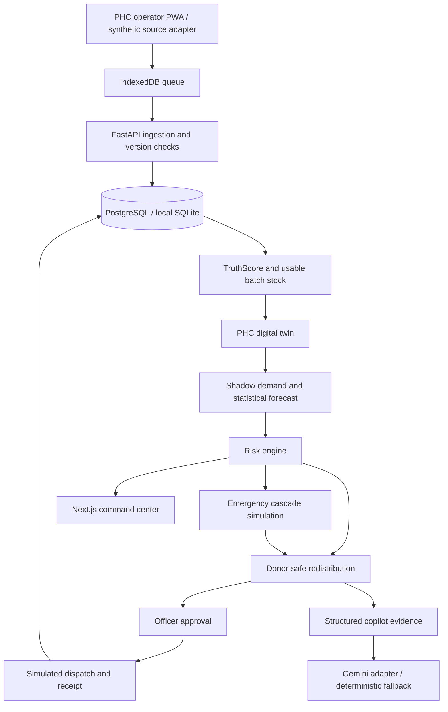
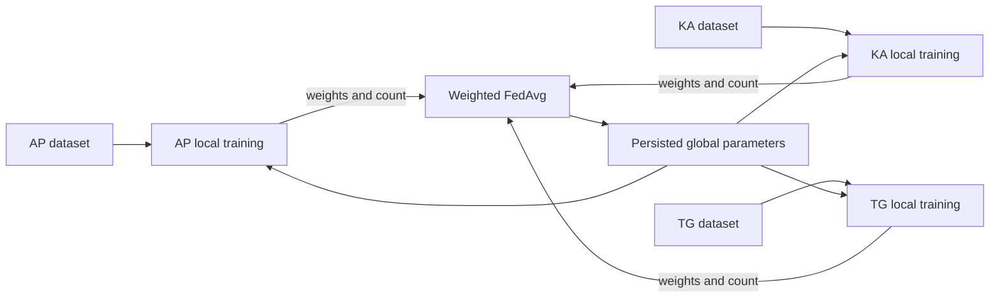

# Architecture

ArogyaMesh is a standalone project. It does not import packages or data from Vighnaharta.

## Boundaries

- `apps/api/db.py`: portable SQLAlchemy schema and initial additive versioned migration. Seed is separate and never runs destructively on normal startup.
- `apps/api/seed.py`: deterministic numeric seed 42, dates relative to seed time. 81 facilities, 1,620 resource records, 145,800 daily resource observations. Raw state training arrays are separate files.
- `services/ml/engine.py`: pure numerical trust, demand, risk, capacity and evaluation functions.
- `apps/api/domain.py`: loads persisted inputs and applies donor constraints. No numerical business rules in React.
- `services/ml/simulation.py`: daily stock ledger, patient spillover and bed occupancy. The intervention pass cannot reuse donated stock twice.
- `services/ml/federation.py`: separate local training workers (logical functions on one host). Aggregation sees only parameter vectors and sample counts.
- `apps/api/main.py`: typed request validation, demo authorization, transactions, audits, OpenAPI and structured logs.
- `apps/web`: Next App Router, typed API consumers, schematic coordinate map, service worker and IndexedDB.

## Data model compromises

Geography, medicines, batches, snapshots, events, plans, runs and audit records use separate tables. Historical observations are per-PHC/per-medicine JSON series; staffing is aggregate attendance by role, not named personnel. Bed/attendance snapshots are latest-state records. This avoids invented identities and keeps a small synthetic demo fast. A production time-series/event pipeline and personnel roster require additional migrations.

Forecast outputs are calculated on demand from preseeded history; no model training occurs on dashboard loads. Federation rounds, simulations, recommendation payloads and inventory changes persist in the database. Offline client stock is provisional until accepted by the versioned API.

## Deployment boundaries

Cloud Run web → private Cloud Run API → Cloud SQL PostgreSQL. Store state datasets in separate regional stores and execute local training in isolated jobs; only updates enter the aggregator. BigQuery receives aggregate analytics through a governed export pipeline. Secret Manager supplies optional Gemini/Vertex credentials. Google route/travel-time integration must replace straight-line distance before operational use. Synthetic integration adapters are not live e-Aushadhi/HMIS/ABDM connections.
